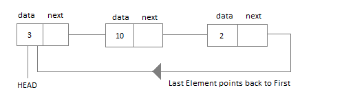

# Circular Linked List

> Circular linked list stores data in nodes

### Node contains

1. Data
1. Pointer reference to next node
1. last node will point to head

### Points to remember

- First node is called head (head is always starts with null).
- From head, each node has a value and a pointer reference to next node.
- Last node will point to head again to make it circular.
