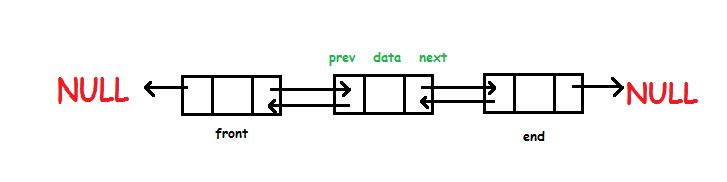

# Doubly Linked List

> Doubly linked list stores data in nodes

### Node contains

1. Pointer reference to previous node
1. Data
1. Pointer reference to next node

### Points to remember

- First node is called head (head is always starts with null).
- From head, each node has a value and a pointer reference to the prev and next node.
- Last node will always be null.

### Time Complexity

- Access `O(N)`
- Search `O(N)`
- Insertion `O(1)`
- Deletion `O(1)`

### Space Complexity

`O(N)`
