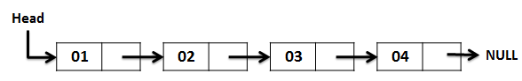

# Singly Linked List

> Linked list stores data in nodes

### Node contains

1. Data
2. Pointer reference to next node

### Points to remember

- First node is called head (A linked list is empty, if its head is null).
- From head, each node has a value and a pointer reference to the next node.
- Last node will always be null.

### Time Complexity

- Access `O(N)`
- Search `O(N)`
- Insertion `O(1)`
- Deletion `O(1)`

### Space Complexity

`O(N)`

#### <a href="./singly_linked_list.js" target="_blank">Implementation in js</a>
